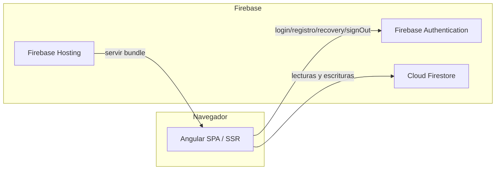
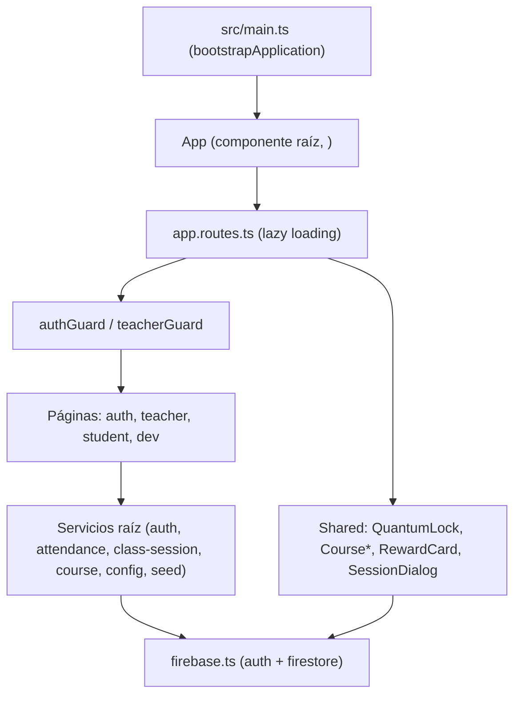
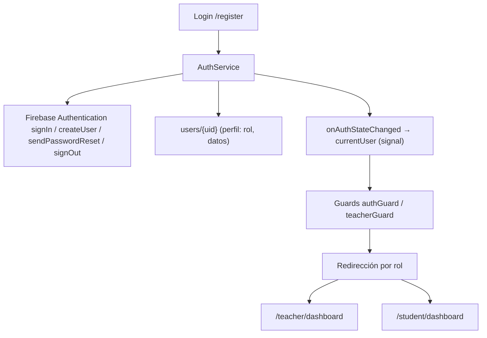
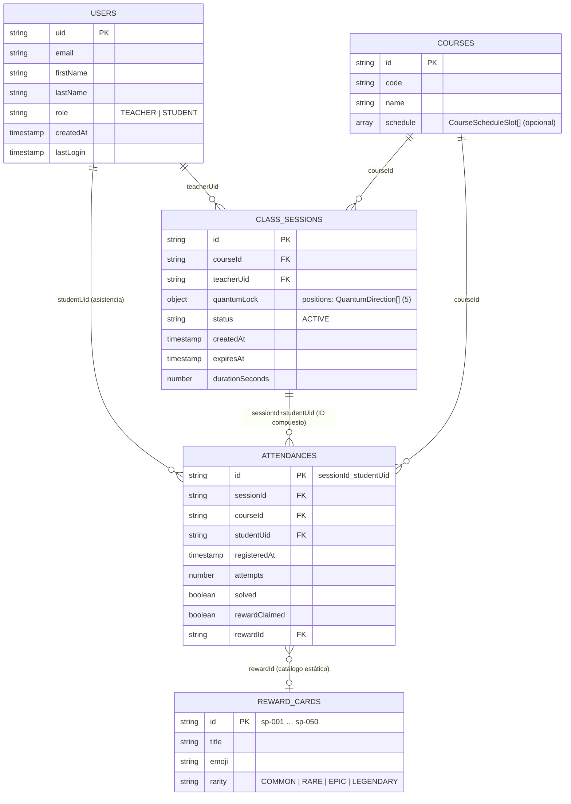
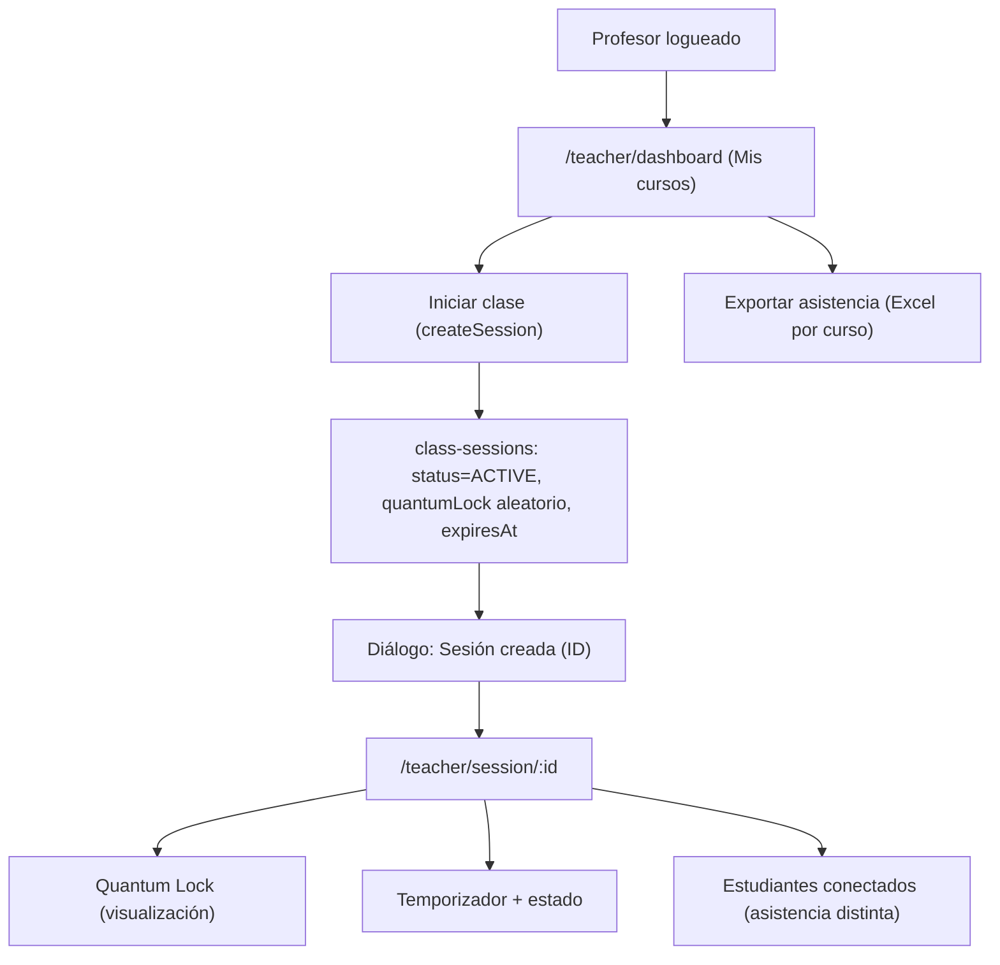
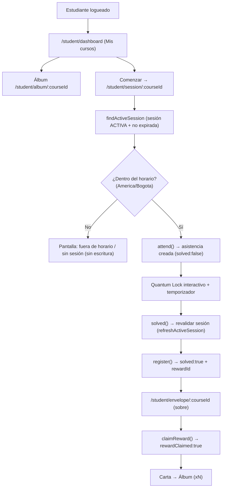
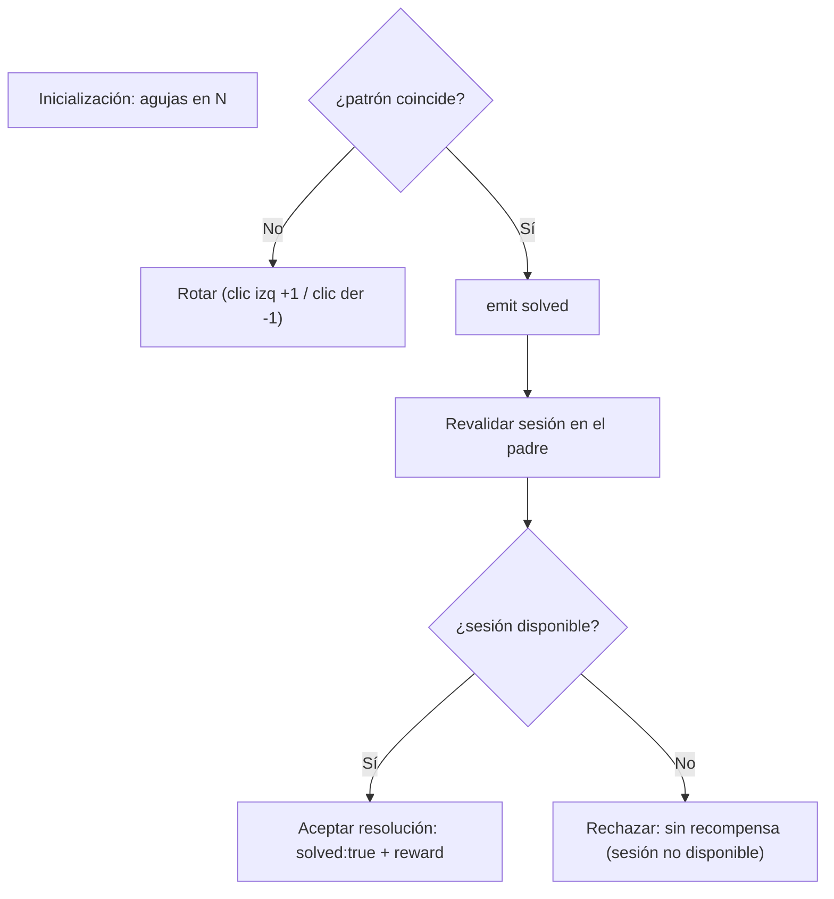
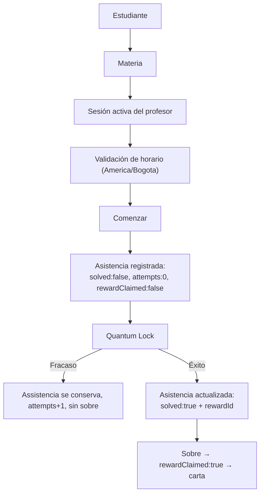
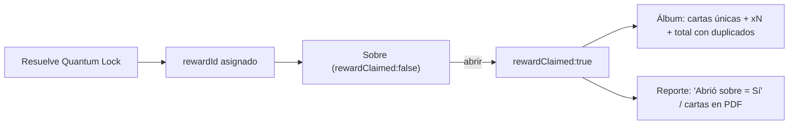
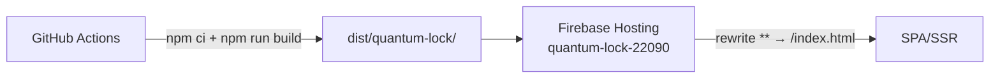

# ARQUITECTURA — Quantum Lock

Documento de referencia de la arquitectura de **Quantum Lock**, elaborado a partir del código fuente del repositorio.

---

## 1. Visión general del sistema

Quantum Lock es una aplicación web **Angular** (SPA con renderizado del lado del servidor opcional) que consume **Firebase** como backend administrado:

- **Firebase Authentication** — autenticación (correo/contraseña).
- **Cloud Firestore** — persistencia de datos.
- **Firebase Hosting** — despliegue del frontend.

---

## 2. Arquitectura del frontend

- **Angular 22 con componentes standalone**; bootstrap con `bootstrapApplication`; sin módulos `NgModule`.
- Router con **carga diferida** (`loadComponent`) por ruta.
- Estado reactivo con **signals** de Angular (servicios raíz y estados locales de páginas).
- SSR habilitado (`outputMode: "server"`): `/login` y `/register` prerenderizados; el resto se renderiza en el cliente (Express + `AngularNodeAppEngine`).
- Estilos: SCSS por componente + tema **Angular Material 3**.

### 2.1 Carpetas clave

| Carpeta | Contenido |
|---|---|
| `src/app/core` | Constantes, enums, guards, servicios, seeders, utilidades de dominio |
| `src/app/features` | Páginas por rol (`auth`, `teacher`, `student`, `dev`) |
| `src/app/shared` | Componentes y datos reutilizables |
| `src/app/models` | Interfaces del dominio |

---

## 3. Arquitectura Firebase

- Inicialización única en `src/app/core/firebase/firebase.ts` (`initializeApp` + `getAuth` + `getFirestore`).
- Firestore con las colecciones: `users`, `courses`, `class-sessions`, `attendances`, `settings`.
- Hosting con rewrite SPA (`** → index.html`) y carpeta pública `dist/quantum-lock/browser`.
- CI/CD: GitHub Actions que ejecutan `npm ci` + `npm run build` y despliegan a Firebase Hosting (rama `main` y previews de PRs).
- Las **Firestore Security Rules no están versionadas** en el repositorio (se administran en la consola de Firebase).

---

## 4. Arquitectura de autenticación

- El rol se determina en el registro desde `AppConfig.admins` y se lee desde Firestore en el login.
- La recuperación de contraseña usa `sendPasswordResetEmail`.
- El logout usa `signOut()` y redirige a `/login` (no toca datos de Firestore).

---

## 5. Modelo de datos (Firestore)

Características clave del modelo:

- **Asistencia** = documento único por par `(sessionId, studentUid)`. Los reintentos no crean duplicados.
- **Recompensa** = la «posesión» de una carta se representa con `rewardId + rewardClaimed` dentro de la asistencia (no hay colección de inventario).
- **Horario** = embebido en el documento del curso (`schedule[]`).
- **Configuración** = documento único `settings/application`.

---

## 6. Flujo del Profesor

- El profesor **crea** la sesión; el estudiante nunca puede crearla ni modificarla.
- La sesión inicia **activa** y termina por **expiración** (`expiresAt`).
- `countSessionStudents` observa `attendances where sessionId` y cuenta `studentUid` distintos.

---

## 7. Flujo del Estudiante

## 8. Flujo del Quantum Lock

- El componente `QuantumLock` (shared) es una **vista de solo emisión de eventos**.
- La **decisión final de éxito** depende del padre: `refreshActiveSession` (RQ06).
- El evento `failed` está declarado pero **no se emite** en el código actual (ver observaciones).

---

## 9. Flujo de asistencia

Regla central: **la asistencia se registra al ingresar con «Comenzar» (sesión activa + horario válido)**; la resolución del Quantum Lock es un evento independiente y el sobre depende de esa resolución.

---

## 10. Flujo de recompensas

- Una carta cuenta para el álbum **solo si** `rewardClaimed === true`.
- Los reportes (Excel del profesor y PDF del estudiante) derivan su información del mismo estado de asistencia/recompensa.

---

## 11. Arquitectura de despliegue

- `firebase.json`: `public: dist/quantum-lock/browser`, rewrite SPA único.
- Proyecto Firebase por defecto: `quantum-lock-22090` (`.firebaserc`).
- Merge a `main` → despliegue en vivo; pull requests → preview.

---

## 12. Observaciones y pendientes

| Tema | Estado |
|---|---|
| `teacherGuard` en `/dev` | Comentado en `app.routes.ts` — accesible sin restricción |
| Evento `failed` del Quantum Lock | No emitido — los intentos fallidos no se registran en `attempts` |
| `maxAttempts` | Configurado pero no aplicado como límite |
| Firestore Security Rules | No versionadas en el repositorio |
| Índices compuestos | No definidos en el repositorio (ej. `findActiveSession`) |
| Separación dev/prod | `environment.development.ts` duplica la configuración de producción |

---

*Documento elaborado a partir del análisis del repositorio Quantum Lock. No se modificó código de la aplicación.*